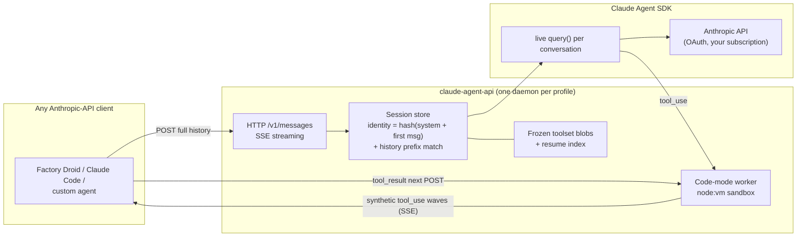
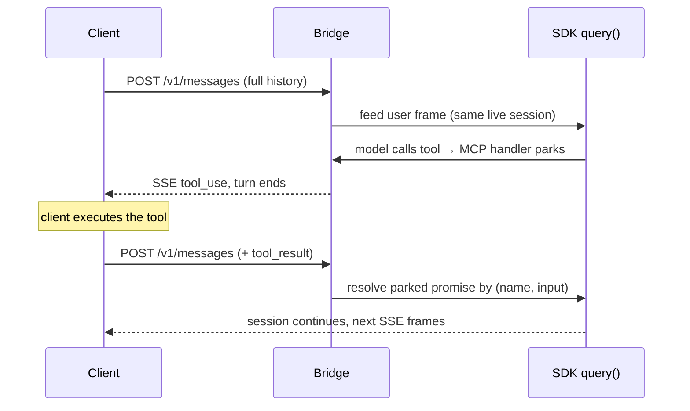
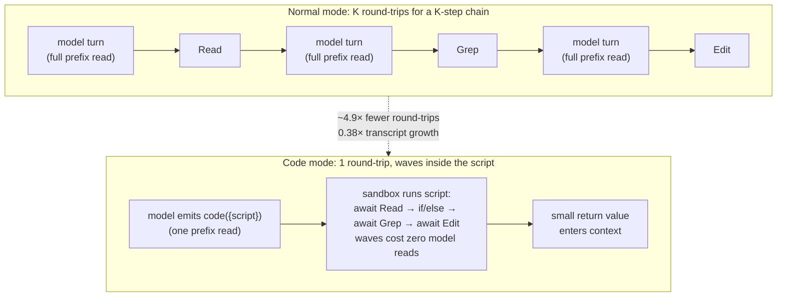
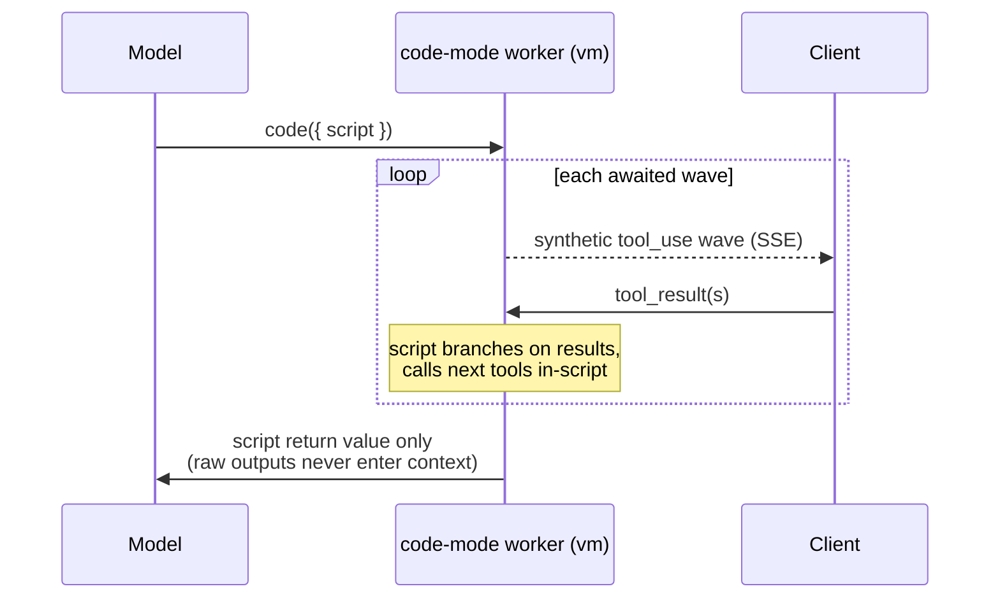

# claude-agent-sdk-to-api

Expose the [Claude Agent SDK](https://www.npmjs.com/package/@anthropic-ai/claude-agent-sdk) as an Anthropic-compatible `/v1/messages` HTTP API, authenticating natively off your already-logged-in Claude OAuth profiles.

Any client that speaks the Anthropic Messages API (Factory Droid, custom agents, scripts) can drive a **multi-turn tool loop** through the SDK while billing against your Claude subscription, with no API key and no token copied into a separate store. Along the way, the bridge restructures the agentic loop itself to cut prompt-cache spend by **80–92% on cache reads** and **~62% on cache writes** in long sessions ([measured](docs/code-mode-cache-savings.md)).

- [What it does](#what-it-does)
- [Architecture](#architecture)
- [Where the savings come from](#where-the-savings-come-from)
- [Quickstart](#quickstart)
- [Feature deep-dives](#code-mode)
- [Observability](#cache-log-per-turn-usage-receipts)
- [Environment knobs](#environment-knobs)

## What it does

| Capability | What you get | Cost lever |
|---|---|---|
| **Anthropic-compatible bridge** | Stateless Messages-API clients drive one live SDK session per conversation | Session reuse instead of re-priming every turn |
| **Code mode** | One `code({ script })` meta-tool collapses multi-step tool chains into one model round-trip | ~4.9× fewer full-prefix cache reads |
| **Script-return filtering** | Raw tool output stays in the sandbox; only the script's return enters model context | 0.38× transcript growth → smaller reads *and* writes |
| **Anchor editing** | Byte-exact `Edit`/`MultiEdit` reconstruction from cached `Read` snapshots | Fewer failed-edit retry round-trips |
| **Frozen toolsets** | The cached prompt prefix is byte-stable across restarts, upgrades, and mid-session tool additions | No surprise 2× prefix re-writes |
| **Caveman compression** | Deterministic prose compression of descriptions and system appends | Smaller one-time cache write per conversation |
| **Native OAuth auth** | Uses your logged-in Claude Code profile(s); no API key, no token copies | Bills your subscription, not a metered key |
| **Receipts** | Per-turn cache-log rows, `/healthz` counters, post-mortem debug ring | Savings are measured, not asserted |

## Architecture



### Why a live session per conversation

The Claude Agent SDK owns tool execution and the assistant transcript. Its streaming input accepts **only user frames**, so a stateless one-shot `query()` per request cannot drive a client that executes its own tools across turns (it can't ingest a pre-baked assistant/`tool_use` history).

A client like Factory Droid speaks the stateless Anthropic API: it POSTs the full history each turn, executes `tool_use` blocks itself, and POSTs back `tool_result`. This bridge reconciles the two models by holding **one live `query()` per conversation**:

- **Session identity** = hash(system + first user message) + a prefix match of the already-processed history. Two conversations that diverge at any turn get separate sessions and cannot bleed into each other.
- **Tools become real MCP handlers.** When the model calls a tool, the handler *parks* on a promise and the `tool_use` streams to the client as SSE; the HTTP turn ends so the client can execute it. The client POSTs the `tool_result` on the next request, the bridge resolves the parked promise by `(tool name, input)` correlation, and the same live session continues.
- **Cold start** (model swap / idle eviction / restart): a fresh session is primed with the full prior transcript so context is recovered; the live loop still drives every new tool call.



## Where the savings come from

Full model, math, and measured receipts: **[docs/code-mode-cache-savings.md](docs/code-mode-cache-savings.md)**. Figures below are measured from 1,645 code-mode turns across 302 conversations (cache-log receipts) against a baseline of 2,889 real Claude Code sessions / 101,936 API responses, priced on the Opus 4.8 card (input $5, cache read $0.50, cache write $10 at 1h TTL, output $25 per MTok).

### The problem shape

In the standard agentic loop, every tool round is a separate API call, and every call **re-reads the entire cached conversation prefix** (0.1×) and **writes the new delta** (2× at 1h TTL). Measured on real Claude Code traffic, **~84% of the bill is cache operations** (46% read + 38% write); input and output are the small buckets. Two structural drivers:

1. **Round-trip count** — real Claude Code is serial: **1.12 tool ops per round-trip**, parallelizing only 7.4% of the time. A 50-op task is ~45 full-prefix re-reads.
2. **Transcript bloat** — every raw tool output (mean 719 tokens, p90 4.6 KB) lands in the transcript and is re-read by *every* subsequent turn. Cache-read cost is **quadratic in session length**.

### The two levers



- **Fewer round-trips.** The model writes one script; dependent chains (read → decide → grep → edit) branch *inside* the script. Measured: **5.53 tool calls per synthetic wave** vs 1.12 per normal round-trip — the same work in ~4.9× fewer full-prefix reads.
- **Less bloat.** Raw tool outputs stay in the sandbox; only the script's return (measured compression **0.38×**) enters context. Every later read is smaller, and the one-time write is smaller too.

### Savings by token bucket

| Bucket | Price weight | Share of normal bill | Reduction | Mechanism |
|---|---|---|---|---|
| **Cache read** | 0.1× | 46% | **80% (short) → 92% (long sessions)** | Fewer round-trips × slimmer prefix; the win grows with session length because reads are quadratic |
| **Cache write** | 2× (1h) | 38% | **~34% → ~62%** (grows with session length) | Slim script returns; frozen toolsets prevent re-writes; caveman + per-tool prose cap shrink the one-time prefix |
| **Output** | 5× | 15% | modest | One script replaces K separate `tool_use` emissions; returns targeted at ~1–2 KB |
| **Input** | 1× | 1% | ~none | Already negligible |

Per-session projection (Opus 4.8, 1h pricing, W = total tool ops):

| W | round-trips normal → code | cache-read cut | cache-write cut | $ saved / session |
|---|---|---|---|---|
| 20 | 18 → 4 | 84% | 34% | $0.23 |
| 50 | 45 → 10 | 87% | 46% | $0.80 |
| 100 | 90 → 19 | 89% | 53% | $2.34 |
| 300 | 268 → 55 | 91% | 58% | $15.87 |
| 800 | 713 → 145 | 92% | 60% | $101.30 |

At org scale: on a hypothetical **$1M/yr** agentic bill, applying these bands with a batchability haircut yields **~$370K (conservative) → ~$530K (aggressive)** per year in avoided cache spend. See [§5 of the savings doc](docs/code-mode-cache-savings.md) for the assumptions.

### Supporting mechanisms (each one defends the levers)

| Mechanism | Where | What it saves |
|---|---|---|
| Truncate-and-spill output cap (16 KB, `codemode.recall(id)`) | code-mode worker | Kills the heavy tail of script returns without error-and-redo round-trips |
| Persistent `state` across `code` calls | code-mode worker | Follow-up scripts read `state` instead of re-reading files |
| Structured script errors (failing line + completed-call ledger) | code-mode worker | Model continues from the ledger instead of redoing completed waves |
| Frozen toolset blobs + warm-window resume | resume index | Daemon restarts/upgrades never re-write a warm prefix at 2× |
| Late tools merge in-band | client-tools | Mid-conversation tool additions append, never invalidate the prefix |
| Caveman compression (`CAVEMAN=full` default) | render layer | Smaller description/system bytes in every fresh prefix write; lossless in-script via `codemode.describe()` |
| Per-tool prose budget (`CODE_TOOL_DESC_MAX_CHARS=700`) | description render | Tens of KB of client tool prose trimmed from the 2× write |
| Anchor editing + live re-anchoring | anchor-edit | Failed-edit retries (the #1 edit failure) eliminated at the source |
| Auto-monitor for backgrounded commands | code-mode worker | Polling a background build/test costs zero model round-trips |
| Consolidation nudge + `singleCallRuns` receipts | code-run | Steers models off the single-call "dribble" pattern; measurable per turn |

Every mechanism is receipt-backed: run with `--cache-log` and price your own rows (see [Cache log](#cache-log-per-turn-usage-receipts)).

## Requirements

- Node.js >= 20
- Logged-in Claude Code profile(s). The SDK's bundled `claude` reads OAuth credentials for the profile named by `CLAUDE_CONFIG_DIR` (macOS Keychain, with a `<profile>/.credentials.json` fallback). Log in with `claude` / `claude setup-token` as usual.

## Quickstart

```bash
npx claude-agent-api --profile ~/.claude --port 32809
# or, from a clone:
npm install && npm start -- --profile ~/.claude --port 32809
```

Health check:

```bash
curl -s http://127.0.0.1:32809/healthz
# {"ok":true,"service":"claude-agent-api","port":32809,"account":"you@example.com","sessions":0}
```

## Authentication (native-first)

The bridge points `CLAUDE_CONFIG_DIR` at a profile and lets the SDK authenticate itself. Precedence:

1. `--token-file <path>` (explicit)
2. `CLAUDE_CODE_OAUTH_TOKEN` in env (explicit)
3. **native profile login** (default)

Variables that could shadow the OAuth path (`ANTHROPIC_API_KEY`, Bedrock/Vertex, base-URL overrides) are stripped automatically.

## Multiple logins, one port each

Run one bridge per profile. Create a `profiles.json` (see `examples/profiles.json`):

```json
{
  "profiles": [
    { "name": "personal", "configDir": "~/.claude", "port": 32809 },
    { "name": "work", "configDir": "~/.claude-work", "port": 32810 }
  ]
}
```

```bash
claude-agent-api start-all --config profiles.json   # foreground, one child per profile
claude-agent-api install   --config profiles.json   # launchd (macOS) / systemd (Linux) per profile
claude-agent-api list      --config profiles.json
claude-agent-api status    --config profiles.json
claude-agent-api doctor    --config profiles.json   # preflight: login + port availability
```

Separate processes mean separate session stores, so profiles never bleed into each other.

## Use from Factory Droid

Add a custom model pointing at the bridge port (see `examples/factory-model.json`). `provider` is `anthropic` (the bridge speaks the standard Messages API) and `apiKey` is unused (the bridge authenticates natively off the Claude profile), but a non-empty placeholder is required by the client:

```json
{
  "model": "claude-opus-4-8",
  "id": "custom:Claude-Opus-OAuth",
  "displayName": "Claude Opus (OAuth)",
  "provider": "anthropic",
  "baseUrl": "http://127.0.0.1:32809",
  "apiKey": "not-used"
}
```

## Use from any client

See `examples/curl-and-client.mjs` for a complete tool round-trip: POST a message, get a `tool_use` back, execute it, POST the `tool_result`, and let the live session continue.

## Working directory (`x-claude-cwd`)

The `Working directory: …` / git-repo / directory-structure context the model sees is generated **server-side**, inside the SDK's Claude Code engine, from that engine's cwd — the client never sends it in the request body. Because this bridge is one long-lived daemon serving many projects, it can't know any client's directory on its own. So each request may carry an `x-claude-cwd` header naming the absolute working directory; the bridge validates it (must be an existing absolute dir), bakes it into that session's SDK `query()`, and includes it in session identity so two projects never share a session. Mid-session `cd` drift self-corrects — the SDK session's own Bash tool tracks cwd from there.

Point Claude Code at the bridge and forward your shell's cwd:

```bash
export ANTHROPIC_BASE_URL=http://127.0.0.1:32809
export ANTHROPIC_CUSTOM_HEADERS="x-claude-cwd: $PWD"
claude
```

Without the header, the bridge falls back to `CLAUDE_PROXY_CWD` (if set and valid), then the daemon's own `process.cwd()`. When the bridge runs as a launchd/systemd service that's usually `/`, so set the header (or `CLAUDE_PROXY_CWD` for a single-project daemon) to get correct directory awareness.

## Code mode

The bridge exposes a single `code({ script })` meta-tool to the model. The model writes an async JavaScript script that calls the client's tools via `await tools.<Name>(args)` (or `await callTool(name, args)`). The bridge runs the script inside a Worker-contained `node:vm` sandbox; each `await`ed tool call becomes a wave of synthetic `tool_use` blocks for the unchanged client, and only the script's return value enters the model's context. This collapses multi-step dependent tool chains (read → decide → grep → read) into **one model round-trip** — tool waves inside `code` cost zero model cache reads.

Original client tools are not advertised to the model directly. They remain available only inside the `code` script runtime.



**Script-first contract:** the script is a full async JS program. Call tools with `await tools.X(args)` / `await tools["Any-Name"](args)` / `await callTool(name, args)` / `await codemode.call(name, args)`. Each call returns a string-like `ToolResult` with `.text`, `.raw`, `.isError`, optional `.anchored`, `.json()`, and `.lines({ trim, nonEmpty })`; common string methods like `.includes()` and `.split()` work directly on the result. Use `codemode.batch([["Tool", args], ...])` or `Promise.all([...])` to run independent calls in one parallel wave. Use `codemode.search(query)` and `codemode.describe(nameOrPath)` for focused in-script tool discovery. Bake branching/loops into the script: if the next step depends on a tool's result, call the next tool from inside the script instead of returning to the model. Sequential `await`s are sequential waves. Do not put order-dependent or side-effect-chained calls in one wave. Only the script's return value is visible to the model. Use `await codemode.exec(source, { interpreter, interpreterArgs, cwd, args, tool })` to run an inline script through the client's shell tool with zero quoting hazards: the source is base64-armored into a mktemp file and executed in one atomic command (interpreter defaults to `node`; `interpreterArgs` are CLI flags injected before the script path, e.g. `["--expose-internals"]`, while `args` land after it as the script's argv; the mktemp file is deleted when the command finishes, so re-running means calling `exec` again — never referencing the temp path from a later shell call), replacing shell-mangled `node -e`/`python -c` one-liners and racy write-temp-then-run sequences (also the escape hatch for BSD-vs-GNU userland gaps on macOS, like `sed -n 'N,+Kp'` or `grep -P`). Shell exit codes are surfaced as-is: `grep`/`rg` exit 1 on no match and `diff` exits 1 on difference, so the description steers scripts to treat those as data (`|| true` in `&&` chains) rather than retrying.

**Background commands are monitored, not babysat:** when a client backgrounds a shell command ("Command running in background with ID: ..."), the worker keeps watching it through the client's own monitor tool — blocking `TaskOutput`, `BashOutput` polling, or `Read` on the reported output file — in client-side waves, and the script's original `await` resolves with the finished output. Zero model round-trips. Scripts that background deliberately (`run_in_background: true`) keep the handle and can attach later with `await codemode.monitor(handle, { until?, intervalMs?, maxMs?, tool? })`. Disable with `CODE_AUTO_MONITOR=0`.

**Output mechanics:** raw tool results are available to the script, but only the final return is sent back into model context. Keep large reads, logs, diffs, and JSON arrays in local variables; return a small decision-ready object with status, counts, paths/line numbers, failing assertions or error tails, and exact snippets needed for the answer or next edit. Filter/map/reduce inside JavaScript instead of returning raw tool dumps.

**Security:** scripts run in `node:vm` inside a Worker (which keeps the parent responsive and lets it terminate the run on abort). By default there are no time/wave/call caps — a `code` script may run as long as it needs and make as many tool waves as it needs (set `CODE_SCRIPT_TIMEOUT_MS`/`CODE_MAX_WAVES`/`CODE_MAX_CALLS` only if you want a ceiling). `node:vm` is not a hard security boundary and the script orchestrates real I/O via the client's tools; the daemon is local and the model is already authorized to request tools, but do not expose this to untrusted callers without hardening (e.g. `isolated-vm`).

Live validation (requires a running bridge):

- `node scripts/live-code-mode.mjs <port>` — smoke test: one wave (Grep+Glob via `Promise.all`) with mocked tool results; confirms the client stream is transparent (no `code` block) and the script completes without a park timeout.
- `node scripts/live-code-mode-ergonomics.mjs <port>` — Haiku validation for the Cloudflare-style code-mode ergonomics: `ToolResult` string behavior, `codemode.search()` / `describe()`, `codemode.batch()`, MCP-shaped tool names, parallel waves, and if/then dependent tool logic.
- `node scripts/live-code-mode-agent-task.mjs <port>` — thorough agent workflow: drives a real research-to-code-to-validate task (web search, multi-file generation in a temp project, allowlisted command validation, iterative fixes) and asserts code mode stayed transparent under a multi-turn, multi-tool workload, including a dependent-chain assertion that one `code` call drove multiple waves. Requires network for `WebSearch`. Env: `MAX_TURNS`, `KEEP_CODE_MODE_FIXTURE=1`, `MODEL`.
- `node scripts/live-extreme-code-mode.mjs <port>` — stress test: uses Haiku by default to drive a multi-turn code-mode session with one 48-call parallel wave plus a dependent count wave guarded by script `if` logic. Env: `MODEL`, `TARGET_PARALLEL_CALLS`, `KEEP_CODE_MODE_FIXTURE=1`.

## Anchor editing

The #1 cause of failed `Edit`/`MultiEdit` calls is an `old_string` that doesn't byte-match the file (the model retypes whitespace or indentation from memory). The bridge already caches the exact bytes the model reads (the client executes `Read` and POSTs the result back through us), so it can free the model from reproducing `old_string` at all.

Every `Read` result inside code mode also carries an `.anchored` view with stable per-line anchor tokens (`a5...`) and the exact gutter-stripped bytes are cached per session. Scripts may pass `start_anchor`/`end_anchor` to `Edit`/`MultiEdit`, and the bridge reconstructs a byte-exact `old_string`/`new_string` from the cached snapshot before fabricating the client tool call. Scripts can also keep deriving `old_string` from the bytes they just read — both work.

- **Live re-anchoring (Dirac-style):** after the client confirms an edit, the bridge applies it to the cached snapshot and re-anchors only the changed lines (unchanged lines keep their tokens). So an edit near the top of a file does not invalidate the anchors below it, and several sequential edits to the same file work without re-reading. A `MultiEdit` resolves all of its ranges against one snapshot, so its edits may be supplied in **any order** (they are sorted and applied ascending); only genuinely overlapping ranges are rejected.
- If an anchor is unknown or stale (no cached snapshot), translation returns an inline error to the script.

## Caveman prose compression

Deterministic, rule-based prose compression ("why use many token when few token do trick") applied to prompt-bound prose as it flows through the bridge — no model calls, just an ordered phrase dictionary plus telegraphic article/filler dropping (`src/caveman.mjs`). **On by default at `full`.** It compresses three surfaces:

- **Client tool descriptions** in the rendered `code` description (compressed *before* the per-tool prose cap, so more substance survives it). Lossless for the model: `codemode.describe/list/search` always serve the full uncompressed docs in-script.
- **The bridge's own `code` description and script-field prose.**
- **The client system append** (CLAUDE.md and friends). This is the one lossy surface — there is no in-script fallback — so it gets its own knob (`CAVEMAN_SYSTEM`).

Protected spans are never touched: code fences, inline backticks, headings, tool signatures, URLs, paths, quoted literals, `<tags>`, ALL-CAPS tokens, JSON-ish lines. If placeholder restoration is ever imperfect, the original bytes ship unchanged (all-or-nothing fail-safe).

Cache story: compression happens at render time only, so compressed bytes are frozen into the toolset blob and replayed verbatim on warm resumes — identical guarantees to the uncompressed path. Pre-caveman conversations keep their frozen uncompressed bytes forever. Toggling the level (or a rules-version bump in a release) changes bytes only for fresh sessions and past-TTL resumes, except the system append, which re-derives each turn — a mid-warm-window toggle costs one 2x prefix re-write and logs a warning. Savings are visible in the startup/`/healthz` levels, a per-fresh-render stderr line, and `cavemanSaved`/`cavemanSystemSaved` in the cache log.

## Frozen toolsets (cache-stable prefixes)

The rendered `code` tool description sits in every conversation's cached prompt prefix; changing its bytes re-writes that prefix at 2×. The bridge enforces that **those bytes may change only when the cache is already dead**:

- **Live sessions** freeze the description at creation.
- **Warm-window resumes** (within the 1h cache TTL) reuse the exact persisted bytes from the conversation's content-addressed toolset blob (`<config>/toolsets/<hash>.json`) — a daemon restart or self-update release can never re-write a warm prefix. Past-TTL resumes re-render freely; that write was happening anyway.
- **Late tools merge, they don't invalidate.** Tools the client adds mid-conversation merge into the script runtime and are announced inside a `code` tool_result — an incremental append, never a prefix re-write.
- **Enforcement:** `test/code-description.golden.test.mjs` fails on any accidental description byte change; `scripts/cache-bust-report.mjs` proves per-conversation byte stability from cache-log receipts and prices any re-write suspects.

## Environment knobs

| Variable | Default | Meaning |
|---|---|---|
| `PORT` | `32809` | Listen port (also `--port`) |
| `HOST` | `127.0.0.1` | Listen host (also `--host`) |
| `SESSION_TTL_MS` | `10800000` | Idle session eviction (3 h default) |
| `TOOL_TIMEOUT_MS` | `1800000` | Parked-tool watchdog; returns an error result so the loop survives |
| `TURN_STALL_TIMEOUT_MS` | `300000` | Turn stall backstop: an attached turn whose session shows zero activity (no SDK events, no tool traffic) for this long is failed with a logged state dump and a real SSE error instead of hanging on keep-alives; `0` disables |
| `HEARTBEAT_MS` | `15000` | SSE keep-alive interval |
| `CODE_SCRIPT_TIMEOUT_MS` | `0` (no cap) | Optional Worker wall-clock cap on a `code` script's own compute; `0` = unlimited |
| `CODE_SCRIPT_MAX_OUTPUT_BYTES` | `16384` | Max bytes for a code script's return value (+console); over-cap output is truncated head+tail (never errored) with the full text spilled to a session artifact reachable via `codemode.recall(id)`; `0` = unlimited |
| `CODE_MAX_WAVES` | `0` (unlimited) | Optional cap on tool-call waves per `code` run; `0` = unlimited |
| `CODE_MAX_CALLS` | `0` (unlimited) | Optional cap on total tool calls per `code` run; `0` = unlimited |
| `CODE_STATE_MAX_BYTES` | `2097152` | Cap on the persistent `state` object code scripts carry across calls in one conversation; over-cap keeps the previous state |
| `CODE_ARTIFACT_BUDGET_BYTES` | `4194304` | Per-session byte budget for truncation-spill artifacts (`codemode.recall`); oldest evicted first |
| `CODE_TOOL_DESC_MAX_CHARS` | `700` | Per-tool prose budget in the rendered `code` description (cache-write weight); signatures always survive, and `codemode.describe("Name")` serves the full docs in-script; `0` = uncapped |
| `CODE_NUDGE_MAX_PER_SESSION` | `2` | Max in-band consolidation nudges per session appended to successful single-tool-call code runs; `0` disables |
| `CODE_AUTO_MONITOR` | `1` | Auto-monitor backgrounded shell commands through the client's own monitor tool; `0` disables |
| `x-claude-cwd` | (header) | Per-request working directory baked into the SDK env block; must be an existing absolute dir |
| `CLAUDE_PROXY_CWD` | `process.cwd()` | Daemon-wide working-directory fallback when no valid `x-claude-cwd` header is sent |
| `CACHE_LOG` | (off) | `1`/`true` → append a per-turn usage row to `<profileDir>/cache-log.jsonl`; or set a path. Also `--cache-log [path]` on `run`, or `"cacheLog": true` per profile |
| `CAVEMAN` | `full` | Caveman prose-compression level for prompt-bound prose: `full` (telegraphic), `lite` (safe phrase dictionary only), `off`/`0` (verbatim). Also `--caveman` on `run`, or `"caveman"` per profile |
| `CAVEMAN_SYSTEM` | (inherits `CAVEMAN`) | Override the level for the client system append only — the one compressed surface with no in-script lossless fallback. Also `--caveman-system` on `run` |

## Cache log (per-turn usage receipts)

With `--cache-log` (or `CACHE_LOG=1`), the bridge appends one JSON line per completed HTTP turn capturing the turn's `read`/`create` (cache-read / cache-creation), `input`, and `output` tokens, plus `conv` (conversation id), `model`, `codeSubCalls`, `codeWaves`, `scriptOutBytes`, `scriptInBytes`, `spills` (truncation-spill artifacts stored), `stateBytes` (persistent `state` size), `codeErrors`, `singleCallRuns` (successful code runs that fabricated exactly one client tool call — the dribble pattern the one-call doctrine targets), `cavemanSaved`/`cavemanSystemSaved` (bytes cut by caveman compression from the fresh description render / the system append), and — on cache-cold turns — `coldReason` (why SDK resume was not possible, e.g. `resume-rejected(prefix-mismatch)` or `cwd-mismatch(...)`). Cache tokens come from the authoritative `message_start` usage and are summed across all upstream messages in the turn (including code-mode internal continuations). Group by `conv` and price with the Opus card to turn the [code-mode savings model](docs/code-mode-cache-savings.md) into measured receipts. The writer is opt-in, append-only (survives restarts), and never throws into the request path. `/healthz` reports the active `cacheLog` path.

**Update visibility:** `/healthz` includes an `update` object (`currentVersion`, `latestSeen`, `lastOutcome`, `lastCheckAt`, `nextCheckAt`, `installing`, and `draining` while a post-install relaunch waits for live work to finish). `POST /update/check` runs one poll tick immediately — check, gated apply, drain-aware relaunch — and returns the outcome, so a fresh release deploys without waiting on the poll cadence or blind-polling `/healthz`.

**Post-mortem debug ring:** always on. The bridge keeps the newest code-mode activity (script starts, synthetic `tool_use` dispatches, resolved `tool_result`s, run completions) in a capped in-memory ring served by `GET /debug/recent?n=100`, mirrored to `<profileDir>/debug-ring.jsonl` (size-rotated, one generation kept) so a crash or relaunch does not erase the evidence. Entry heads are byte-capped (`DEBUG_RING_HEAD_BYTES`, default 2KB; `DEBUG_RING_ENTRIES`, default 500) — it is a forensic index, not a transcript.

## Tests

```bash
npm test                 # optimized node:test runner over test/*.test.mjs
npm run test:changed     # conservative changed-file/dependency selection
npm run test:profile     # serial per-file timing report with hotspot summary
npm run test:hotspots    # scanned slow-risk summary without executing tests
TEST_SHARD=1/4 npm test  # run one deterministic shard
TEST_SHARD=1/4 node scripts/test-suite.mjs --list  # inspect shard composition
```

Runner knobs: `TEST_CONCURRENCY`, `TEST_SHARD=index/total`, `TEST_CHANGED_BASE`, and `TEST_TIMINGS_JSON`.

## License

MIT
